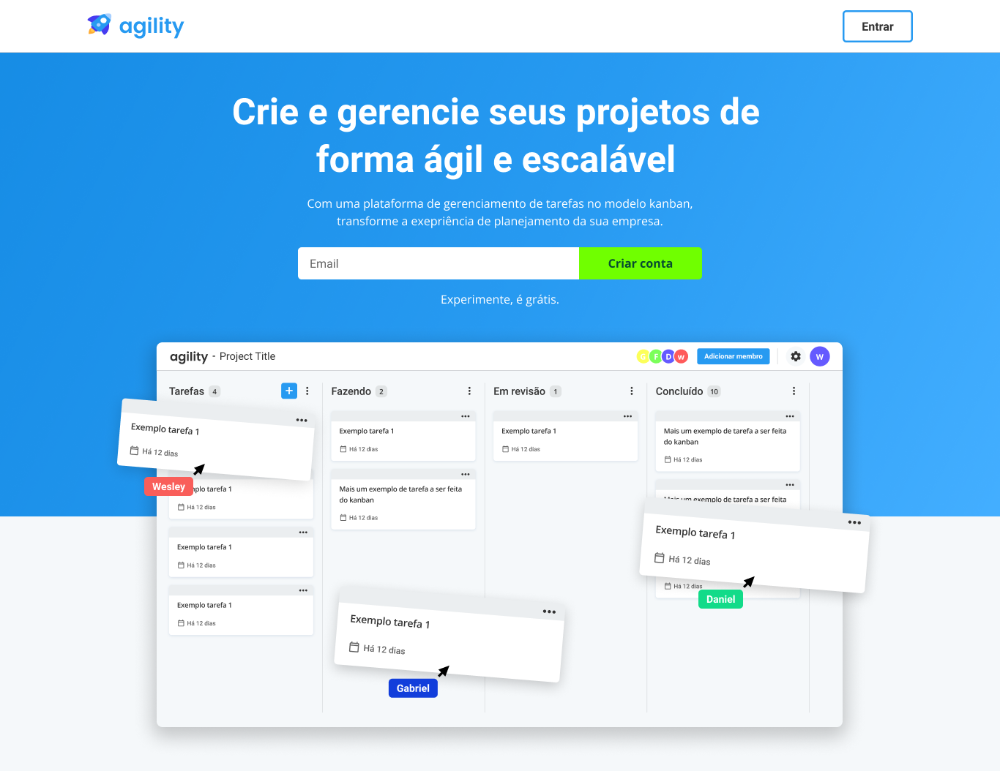

  

Frontend de um sistema de gerenciamento de tarefas no modelo kanban.

  
  
  
  

Você pode ver o repositório backend do projeto clicando <a href="https://github.com/wesleyoliveira820/agility-backend">aqui</a>

<h4 align="center">
  🚧  Agility 🚀 Em construção...  🚧
</h4>

## Sobre

  

Neste repositório contém o frontend de um sistema de gerenciamento de tarefas no modelo kanban inspirado no [Trello](https://trello.com) e [Azure Boards](https://azure.microsoft.com/pt-br/services/devops/boards/).

### Preview

* [Protótipo no Figma](https://www.figma.com/file/HyHtd5RPjX6usHCKnFWCLl/Agility?node-id=240%3A50)

### Funcionalidades

- [x] Landing page
- [ ] Tela de cadastro
- [ ] Tela de Login
- [ ] Telas de recuperação de senha
- [ ] Dashboard de projetos
- [ ] Tela de kanban do projeto
- [ ] Tela de configurações
- [ ] Tela de Membros
- [ ] Tela de Informações do projeto

### Tecnologias utilizadas (Até o momento)

* [Typescript](https://www.typescriptlang.org/)
* [ReactJS](https://reactjs.org/)
* [Styled components](https://styled-components.com/)
* [Node.JS](https://nodejs.org/en/)

## Instalação

  🚧  Em breve tutorial de instalação  🚧
